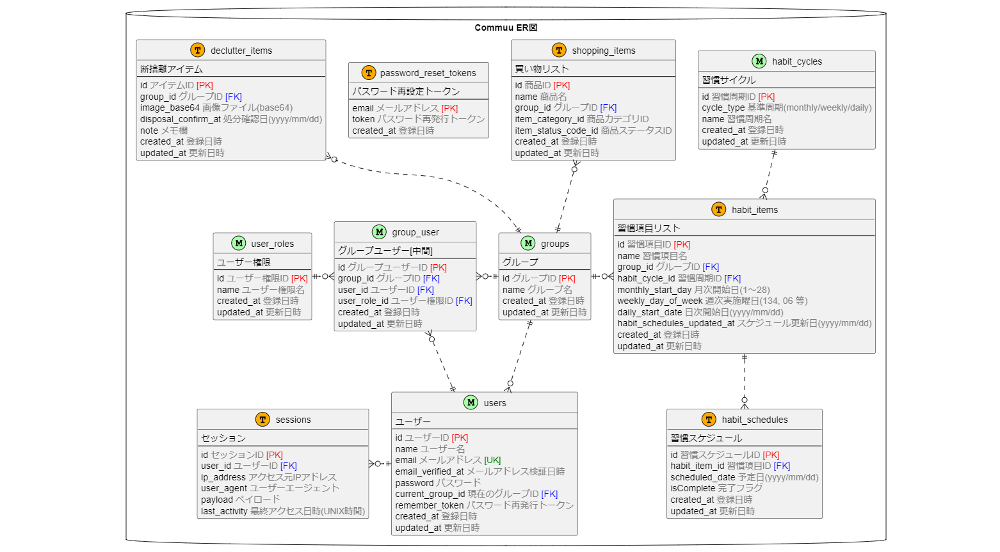

# Commuu とは？
Commuu（コミュー）は家族やルームメイト、サークルメンバーなど、小規模なコミュニティの日常生活が円滑に回るようサポートするWebサービスです。

本サービスでは、コミュニティ内で共有すべき情報を管理できます。

適切に管理することで、共同生活の中で発生する「ちょっとしたモヤモヤ」を未然に防ぐことにつながります。

| ⛅ ちょっとしたモヤモヤ | 💡 本サービスによるサポート |
| :--- | :--- |
| スーパーで買い物してきてくれたけど、タイミングが合わず必要なモノを伝えられなかった...。一緒にティッシュペーパーも買ってきてくれたら助かった。 | 「買い物リスト」をメンバー間で共有しておく事で、急な買い物でも必要なモノをまとめて購入可能！ |
| 名もなき家事（日常的な作業）を含めると、家事の担当が偏ってきた気がする...。お互い仕事も忙しいけど、家事分担を一度見直したい。 | 「定期To-Do」として日常的な作業を登録し、メンバー間で共有することで、お互いの負担状況を可視化。その結果、分担の見直しや、「いつもありがとう」という一言につながるかも！ |
| 何年も使っていないから処分したい、処分してほしいモノがあるけど、なかなか踏み切れない...。納得してもらえるだろうか。 | 「断捨離」するモノとして記録を残すことで、一定期間使っていないことを明確化。皆が納得した上で処分できる！ |

このような「ちょっとしたモヤモヤ」を解消することで、各コミュニティの日常生活がより円滑に進むことを目指しています。

 
 

# サービスのURL
https://commuu.masaotech.com/  

※ ログイン画面下部からゲストユーザーとしてお試し頂けます

 
 

# 主な機能
| 機能名 | 概要 |
| :--- | :--- |
| アカウント機能 | ユーザーアカウントの作成、編集 |
| グループ機能 | グループの作成、編集、ユーザーの紐づけ |
| 買い物リスト機能 | 購入品の追加、編集、グルーピング |
| 定期To-Do機能 | 月次/週次/日次の作業登録、実施状況の記録 |
| 断捨離サポート機能 | 不用品の情報登録、処分日程の確認 |

 
 

# ER図

 
 

# 画面一覧
| 買い物リスト メイン画面  | 買い物リスト 設定画面 |
| :--- | :--- |
| ●　商品の一覧表示 ●　商品の追加 ●　商品の購入ステータス変更 ●　表示する商品の絞り込み  | ●　商品の名前/カテゴリの編集 ●　商品の削除  |
|   |   |
 

| 定期To-Do メイン画面  | 定期To-Do 設定画面 |
| :--- | :--- |
| ●　定期 To-Do の実施予定一覧表示 ●　定期 To-Do の実施ステータス変更 | ●　定期 To-Do の追加（月/週/日 単位） ●　設定済みの定期 To-Do の一覧表示 ●　定期 To-Do の削除  |
|   |   |
 

| 断捨離サポート 画面  | グループ切替画面 |
| :--- | :--- |
| ●　処分予定品の一覧表示 ●　処分予定品の追加/削除 | ●　表示グループの切替 |
|   |  |
 

| グループ編集 一覧画面  | グループ編集 設定画面 |
| :--- | :--- |
| ●　所属グループの一覧表示 | ●　グループの編集 ●　グループメンバーの編集/削除 ●　グループメンバーの追加 ●　グループの削除  |
|   |   |
 

| ログイン画面  | パスワードリセット画面 |
| :--- | :--- |
| ●　ログイン | ●　パスワードリセットメール送信 |
|  |  |
 

| アカウント管理画面  | アカウント新規登録画面 |
| :--- | :--- |
| ●　アカウント情報の更新 ●　パスワード変更 ●　アカウント削除 | ●　アカウントの新規作成 |
|   |  |
  
 
 

# 使用している主な技術
* サーバ/OS
    * KAGOYA CLOUD VPS
    * CentOS 9
* ミドルウェア
    * Apache 2.4
    * MySQL 8.4
    * postfix 3.5
* 言語/フレームワーク
    * PHP 8.3
    * Laravel 11
    * Blade Templates
    * javascript
    * jQuery
    * Tailwind CSS
  
 
 

# こだわった点
* データのセキュリティとプライバシー保護を考慮し、通信の暗号化や認証認可のアクセス制御を強化
* スマートフォンなどの小さな画面でもPCと同じ操作ステップ数で完結できるよう、レスポンシブデザインを工夫
* 操作負担を最小限に抑えるため、入力情報は最小限の項目で構成
* 買い物リストのカテゴリ分けは色指定のみに制限し、シンプルで分かりやすいUIを実現
* 同一画面で短時間に多くの操作を行う場面では Ajax 通信を活用し、画面遷移を最小化
* 表示件数が多くなる画面にはページネーションを導入し、読み込み速度を向上
* ディスク使用量を抑えつつレスポンス速度を向上させるため、画像は実用に耐える範囲で画質を最適化して保存
  
 
 

# 今後の展望
「定期To-Do」機能を重点的に強化予定です

 

1. **適切な担当分配につながる機能強化**

    名もなき家事を含む家事の担当が適切に分担されるよう、以下の機能追加を検討中
    * 作業ごとの重み付け設定（作業ボリュームを考慮した分担が可能に）
    * 作業担当の機械的な割り振り（公平な分担を実現）
    * 月次単位での集計レポート通知（負担の偏りを分析）

 

2. **子供も楽しく使えるUX**

    子供が楽しみながら家事に参加できるよう、以下の機能追加を検討中
    * To-Do完了時のアクション（各メンバーの印鑑スタンプを押すような遊び心のある仕組み）
    * 実施記録のカレンダー表示（実施者ごとに色分けして可視化）
    * 担当できる作業が増え、貢献度が向上していることを実感できる対応履歴のサマリ表示

     

    子供も積極的に家事に参加できる環境をサポートすることで、次のような効果を目指します
    * 家事を通じた自立心やライフスキルの向上
    * 子育て世代の負担軽減
